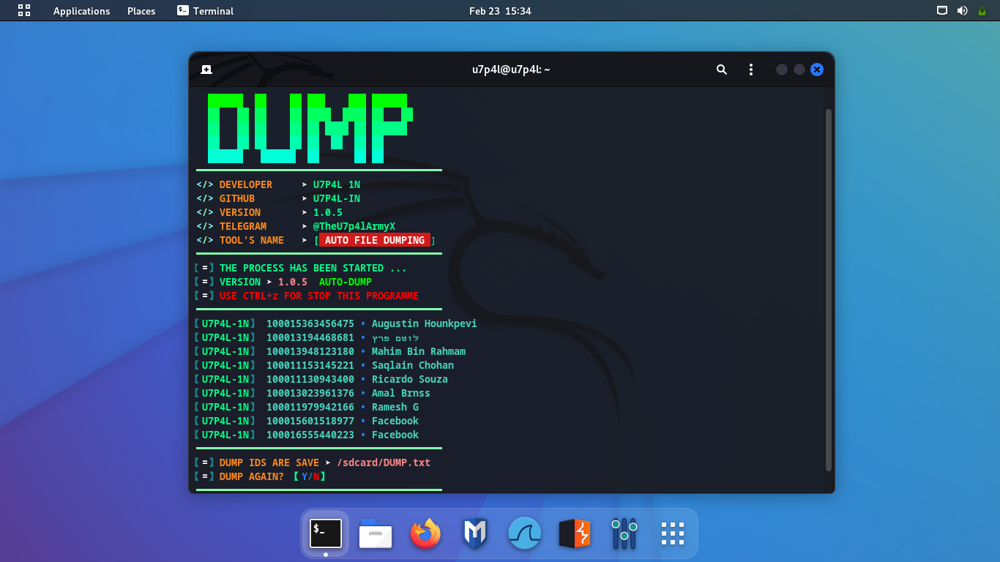

<p align="center"></p>

</p>
   <p align="center">
      <a href="https://github.com/U7P4L-IN/DUMP/stargazers">
      </a>
      <a href="https://github.com/U7P4L-IN/U-DDOS/releases/latest">
      </a>
      <a href="https://www.conventionalcommits.org/en/v1.0.0/">
      </a>
      <a href="https://github.com/U7P4L-IN/DUMP/actions/workflows/github-action.yml">
      </a>
   </p>
   
<p align="center">

>Dumping Fb New Id With Full Name.Single Spilt Automatic Fb Numeric Id Gathering. All Tyep Id Dumping And Automatic One File Save.

</p>

## Log In Method - 
- LOG IN WITHOUT COOKIES & TOKEN
- LOG IN WITHOUT FB PASSWORD

## Language</br>

<p align="center"> 

 </div>
 
### INSTALL TOOL ON TERMUX
```python
apt update && apt upgrade -y
pkg install git
pkg install python
rm -rf DUMP
git clone --depth=1 https://github.com/U7P4L-IN/DUMP.git
cd DUMP
ls
python DUMP.py
```
<h5 align="center"><b>TERMUX INSTALLATION > </b></h5>
<p align="center"></p>

<p align="center"></p>

### Kali Linux / Ubuntu / Parrot OS :
```python
sudo apt-get update && apt-get install git
git clone https://github.com/U7P4L-IN/DUMP.git
cd DUMP
ls
sudo python3 DUMP.py
```
<h5 align="center"><b>KALI LINUX > </b></h5>

<p align="center">

<p align="center">  <a href="https://t.me/AN0NYM0U5_X"></a></p>
 
## NOTE - 
- You See Any Error Of This Command.So,Frist Run Termux Setup Command

## Tools Languages :

<p align="center"></p>

<h5 align="center"><b>DESCRIPTION</b></h5>

> [!NOTE]  
> All the tools are belongs to their copyright owner, and this use is in accordance with the terms and conditions of the copyright holder.

# Give A Star ⭐

> You can also give this repository a star to show more people and they can use this repository
